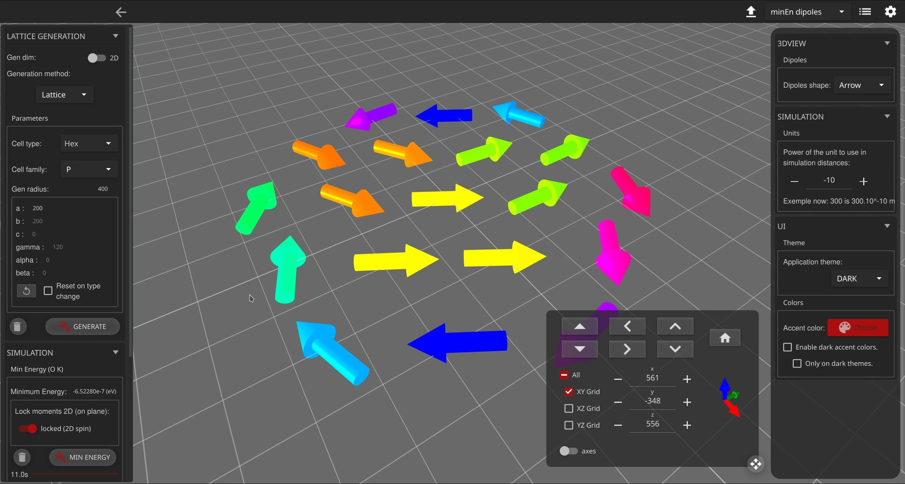
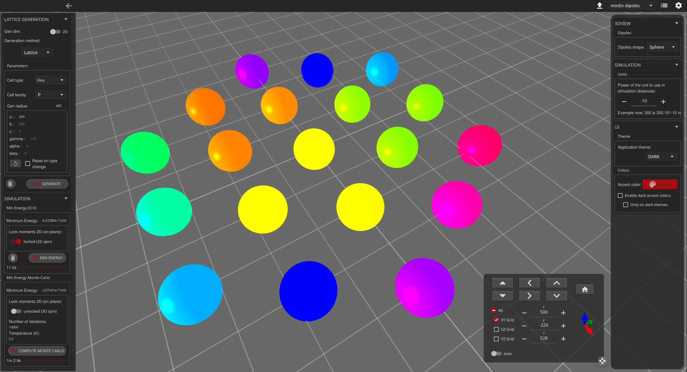

# DipSim

DipSim is a Python program for simulating dipoles (and their associated moments). It has multiple way to generate/import dipoles and later find there minimal energy. Uses Python and scipy to compute and the framework Qt and its QML engine to render everything.



---

## Features

* Dipoles generation according to different Bravais lattice (2D and 3D) parameters. Possible to edit: 
    * axial distances (a, b, c)
    * axial angles (alpha, beta, gamma)
    * generation radius
    * type : hexagonal, monoclinic, ...
    * family : P, I, ...
* Dipoles generation randomly:
    * max distance of generation
    * number of dipoles randomly generated
    * limits : sphere or square 
    * dimension : 2D or 3D
* Import and export option of the dipoles (file in .csv)
* Energy minimization (Magnetic dipole-dipole interaction) with two solving method:
    * Nonlinear conjugate gradient algorithm (T=0K)
    * Monte-Carlo with Metropolis algorithm (T>0K)
* 3D visualization with a UI to control:
    * generation
    * simulation
    * view
---

## Requirements

* recent version of python 3 compatible with other dependencies (pyside2, numpy and scipy notably)
* a desktop environment (cannot run on a server since it's a GUI/rendering based project)
* an internet connection
* ... and you should be ready to play with dipoles in no time !

## ⚠ Tested on

( kubuntu 20.04 LTS ; python 3.8.2 64 bit ; pyside 5.15 ; scipy 1.5.1 ; numpy 1.19.0 )

---

## Installation

It's best to match version of dependencies already tested in the previous section 😉.

Install [python3](https://www.python.org/downloads/) on your system (virtual environment currently not tested). Follow instruction on previous link for more information about how to install python3.

Use the package manager [pip](https://pip.pypa.io/en/stable/) to install pyside2, numpy and scipy.

```bash
pip3 install pyside2 numpy scipy
```

[Download](https://github.com/ndeybach/DipSim) this repository and place it in a folder (we will refer to it as `path/to/DipSim/` )

* if you have [git](https://git-scm.com/downloads) installed, you can use the following command:

        git clone https://github.com/ndeybach/DipSim

You should be ready to go !

## Usage

Go to the downloaded directory and launch DipSim by executing the following command:

```bash
python3 path/to/DipSim/main.py
```

You are now in front of the main interface :



On top right you have different settings:

* an export button : will open a window letting you export your dipoles (initial ones and/or computed ones)
* a combobox letting you choose which dipoles are displayed in 3D view
* a list of initial dipoles (mainly for debugging purposes)
* a setting button opening the right panel with application settings (most are self-explenatory)

On the left you have the drawer where all simulations and generations of dipoles happen.
* the first panel let you generate dipoles. Multiple options are available :
  * from import. You just select the .csv files you want to import (see structure of a dummy export for how to format it)
  * from randomly generated dipoles.
  * from a bravais lattice structure. All parameters are customizable (see [this](https://en.wikipedia.org/wiki/Bravais_lattice) wikipedia article for more information) 
* the second panel offers two ways of minimizing the global energy of a group of dipoles.
  * first at 0 K with a standard magnetic dipole–dipole interaction formula.
  * the second allow estimating the global energy with a Monte Carlo approach at a given temperature.

At the bottom-right corner is a button opening a panel allowing changing the rendering and move around.

---

## Known bugs

* some initial dipoles are missing in 3D view. They are not missing in the data, only not displayed. Happens randomly. Maybe a qt quick 3D bug ?
* 3D lattice generation has a problem with angles different than 90°. It is probably missing a projection coefficient. Thus they will be missing some dipoles on some sides.

## To do

* add a way to change the moments with gui on generation types random and lattice.
  
* debug multithreading on computing of minimum energy with Monte Carlo technic. Currently implemented using a list of qthread (referred as threadpool) and each participate in global iteration number. But a race happens and only last qthread calls its function `run()`. Which is essentially the same as computing with a single thread.
* package DipSim in a single executable and release it. Makes it even simpler to use.
* implement a custom bravais cell type with maybe a table where you can add/remove individual translations.
* add phase change graphs at multiple low temperatures in Monte Carlo minimisation.
* move lattice generation to a thread. So that it doesn't the UI in long generations (3D or small angles)
* display info when dipole is clicked/picked in 3D view.
* add even more simulation/compute technic and features ! Feel free to commit any idea !

---

## Notes

* If you enter a wrong value and DipSim doesn't start anymore (maybe because a calculation is too big with previously entered value), then you have to delete DipSim's settings. They are located as indicated in [QSettings documentation](https://doc.qt.io/qt-5/qsettings.html#platform-specific-notes). It will reset everything to default.

---

## About

DipSim is the result of 6 weeks of internship at the IPR (Institut de Physique de Rennes) of two students in second year of a bachelor's degree : Nils DEYBACH and Léo Oudart. The initial project was realized in June and July 2020.

## Contributing

Pull requests are welcome. For major changes, please open an issue first to discuss what you would like to change.

Since this was originally a 6 week internship project, we (the original authors) cannot garanty any prompt answer. It will be a on a best effort basis.

## License
[MIT](https://choosealicense.com/licenses/mit/)
